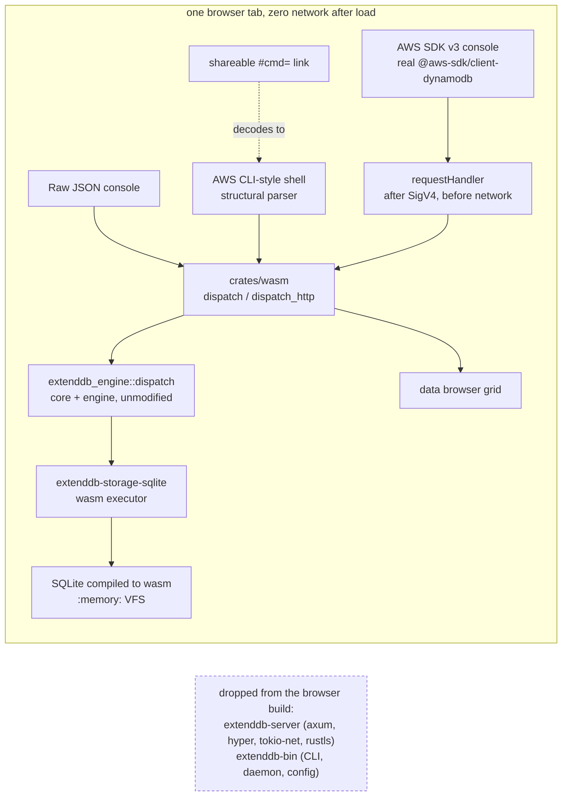
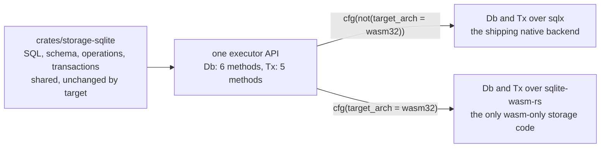

# Design: Browser WASM Playground

> Status: proposed (RFC). Decision requested before the first implementation PR lands.
> Scope: v1 in-browser playground. The npm package, persistence, and the rest of the
> API surface are out of scope and are listed in section 16.
> Related: [02-high-level-design.md](02-high-level-design.md),
> [04-component-storage.md](04-component-storage.md),
> [09-testing.md](09-testing.md).

## 1. Overview

A visitor opens a web page. The ExtendDB engine loads as a WebAssembly module and
Amazon DynamoDB API calls run inside the browser tab. There is no AWS account, no
backend service, and no network traffic after the initial asset download.

The load-bearing property is that this is not a simulator. The browser build
compiles the same `extenddb-core`, `extenddb-engine`, `extenddb-storage`, and
`extenddb-storage-sqlite` crates as the native server, over real SQLite compiled
to wasm. Validation, wire format, error mapping, expression evaluation, and
capacity accounting are the same compilation units. Conformance behavior is
inherited rather than reimplemented.

A proof of concept of this shape has been built and demonstrated: the core data
plane, three front ends over one dispatch entry point, and headless-browser tests
asserting zero network. This document proposes what to productionize from it, what
to leave out, the invariants the design depends on, and a rollout in four PRs.

## 2. Motivation and goals

Evaluating ExtendDB today means cloning the repository, installing a Rust
toolchain or a container runtime, standing up a storage backend, generating TLS
certificates, and provisioning IAM credentials. That is a reasonable path for an
operator and a poor path for someone deciding whether to spend an afternoon on the
project.

Goals for v1:

1. **Zero-friction evaluation.** A URL replaces the setup. A visitor issues real
   API calls within seconds of the page loading.
2. **Live evidence that the engine is the real engine.** An unmodified
   `@aws-sdk/client-dynamodb` v3 client, running in the page, receives the same
   typed exceptions from the same error-mapping code the native server uses.
3. **Nothing to operate.** The playground is static assets on a CDN. No compute,
   no database, no credentials, no on-call surface.
4. **No new correctness surface above the driver.** The wasm build reuses validation,
   wire format, error mapping, expression evaluation, and the SQL and operation code
   rather than adding a second implementation that can drift. The one deliberate second
   implementation is the executor itself, which is a driver rather than logic, and section
   14.3 records the obligation that comes with it.

## 3. Non-goals for v1

Stated bluntly so that review does not have to infer them.

- **No persistence of any kind.** No OPFS, no IndexedDB, no export or import of
  the database. A page refresh discards everything.
- **No npm package.** `@extenddb/wasm` is not published. The `--target nodejs`
  build is retained only as a test vehicle, with no public API commitment and no
  versioning promise.
- **No auth boundary.** Nothing on the wasm path verifies SigV4 or evaluates IAM
  policy. See section 8.1.
- **No streams, TTL, backup and restore, import and export, tags, or management
  and IAM APIs.** These are rejected rather than served. Section 9.2 covers what the
  rejection looks like today, which is not yet what it should be.
- **Not a production data store, not a benchmark target.** The playground makes no
  durability, availability, or performance claim. Numbers measured in a browser tab
  against an in-memory database are not ExtendDB performance numbers.

## 4. Architecture

### 4.1 The dispatch seam

`extenddb-engine` already exposes a transport-agnostic entry point:

```rust
pub async fn dispatch(
    operation: &str,
    body: serde_json::Value,
    ctx: &OperationContext,
    server_addr: &str,
) -> Result<DispatchResult, DynamoDbError>;
```

On the native path, `extenddb-server` terminates TLS, parses `X-Amz-Target`,
authenticates the request, and calls this function. On the browser path, a
`wasm-bindgen` export takes the same target string and the same JSON body and
calls the same function. The engine is not reimplemented for the browser.

The precise claim is worth making precisely. On the mainline, `dispatch` carries no
target gates at all. The wasm crate work adds two, on the `ImportTable` and
`ExportTableToPointInTime` arms, because the import and export module does not compile
for the target. Everything else between the request text and the storage engine is
the same code on both paths.

Two consequences worth stating plainly:

- Every behavior the conformance suite exercises above the transport is present in
  the browser build by construction. A validation message fix, an expression
  evaluation fix, or a capacity accounting fix reaches the playground when it
  reaches the server, with no porting step.
- A new front end is a parser, not a second engine. The CLI shell, the SDK
  console, and the raw console all reduce to a target string plus a JSON body.

### 4.2 What crosses to wasm and what does not



| Crate | Browser build |
|---|---|
| `extenddb-core` | compiled, with one feature addition (section 4.3) |
| `extenddb-engine` | compiled, with `tokio` native-only and two dispatch arms gated (section 4.3) |
| `extenddb-storage` (traits) | compiled, with six dependencies plus the runtime-hooks and backend-registry surface native-only (section 4.3) |
| `extenddb-storage-sqlite` | compiled with the wasm executor, manifest split by target (section 6) |
| `extenddb-auth` | compiled, after an unconditional swap from `axum` to `http` (section 4.3) |
| `extenddb-cache` | compiled, with a pass-through cache on wasm (section 4.3) |
| `extenddb-server` | dropped: axum, hyper, tokio-net, rustls are native-only and not needed |
| `extenddb-bin` | dropped: CLI, daemon lifecycle, config files |

### 4.3 Shared-crate changes the wasm target needs

This list was re-verified against `upstream/main` rather than against the
proof-of-concept branch, because several of these have moved since that branch was
built. Read the table as "what the wasm crate work does to a crate you may own".

| Crate | What changes | Mechanism | Native impact |
|---|---|---|---|
| `extenddb-core` | `time` gains the `wasm-bindgen` feature, so time formatting has a clock source in a browser | feature addition | none |
| `extenddb-auth` | `axum` is replaced by `http`, and three files import `http::HeaderMap` instead of `axum::http::HeaderMap` | unconditional, every target | type-identical, see below |
| `extenddb-cache` | a pass-through stale-while-revalidate implementation with no `moka` and no background refresh task | target-gated module | none |
| `extenddb-engine` | `tokio` moves to a native-only dependency table; the three `SystemTime::now` sites in `streams.rs` (lines 142, 203, 237, all computing Unix epoch seconds for shard iterators) move to the `time` crate's UTC clock, which is what the `wasm-bindgen` feature in the row above enables; and the `ImportTable` and `ExportTableToPointInTime` dispatch arms are gated off | `cfg(not(target_arch = "wasm32"))` plus a clock swap | none |
| `extenddb-storage` | six dependencies move native-only: `extenddb-auth`, `tokio`, `tokio-util`, `bcrypt`, `rand`, `aes-gcm`. The runtime-hooks surface and the backend registry move with them | `cfg(not(target_arch = "wasm32"))` | none |
| `extenddb-storage-sqlite` | the executor seam, and a manifest that splits by target (section 6.4) | `cfg(target_arch)` | zero behavior change, evidenced per section 14 |
| `uuid` (workspace) | the `js` feature, so v4 generation has a randomness source in a browser | feature addition | none |

**The auth change is not target-gated, and that is on purpose.** `extenddb-auth` takes
its `HeaderMap` from the `http` crate rather than from `axum::http`, on every target,
which drops axum from the wasm dependency graph. axum re-exports `http`, and the
workspace resolves a single `http` version, so this is the same type and the public
`AuthProvider` signature is unchanged. The lockfile evidence: `axum` 0.8.9 depends on
`http`, and exactly one `http` version (1.4.0) is resolved.

That single-version property is what makes the swap safe, and today it is incidental
rather than deliberate, which is the reason `http` belongs in the workspace dependency
table rather than pinned inside the crate. If axum later moves to `http` 2.x while
`extenddb-auth` pins `http = "1"`, the graph carries two `http` versions, the two
`HeaderMap` types stop being the same type, and the break appears at the
`AuthProvider` boundary in `extenddb-server` rather than anywhere near auth. A
workspace entry makes that a single deliberate decision instead of a silent one.

**`extenddb-storage` has drifted since the proof of concept, and it is now the
harder row.** `storage/src/hooks.rs` uses `CancellationToken`, `tokio::select!`, and
`tokio::time::sleep`, and `ServerRuntimeHooks::spawn_workers` returns
`Vec<tokio::task::JoinHandle<()>>`. That is a public trait method, so the tokio types
are part of the crate's public API rather than an implementation detail, and
`lib.rs:32` re-exports `CancellationToken` with no gate. The newer `backend.rs`
imports both modules the wasm build gates off, `server_components` and
`bootstrapper`, so `Backend`, `set_backend`, `try_backend`, and `backend_name` become
native-only as well. The backend registry is the newest deliberately designed code in
that crate, so this row will get the closest reading from its author, and it is the
row most likely to need a different answer than the one above.

**Two proof-of-concept details that are not carried forward.** It used `web-time`,
which appears nowhere on the mainline; the real need is the `time` feature in the
table. And there is no direct `getrandom` dependency to configure, only `uuid`'s `js`
feature. If getrandom 0.3 arrives in the graph and wants
`--cfg getrandom_backend="wasm_js"`, that is a build-flag decision the wasm crate work
makes and records, not a dependency change.

This gating is exactly what the CI gate in section 12 protects. Without the gate,
any of it can be silently undone by an unrelated change.

## 5. Storage

### 5.1 Real SQLite in wasm linear memory

The wasm build uses `sqlite-wasm-rs`, which compiles the SQLite C amalgamation to
WebAssembly. This is real SQLite, running the same SQL the native SQLite backend
runs, on the `:memory:` VFS, single-threaded, built with `SQLITE_THREADSAFE=0`.

Once the executor seam lands, the wasm path also gets the merged backend's real
schema: per-table data tables, per-index tables, and order-preserving TEXT
encoding for numeric sort keys. The proof of concept used a simplified single-table
layout, which is one of the reasons its storage crate is not carried forward.

### 5.2 User-visible semantics

The database is SQLite pages living in the wasm module's linear memory. Closing the
tab or refreshing the page drops the module, and the data goes with it. There is no
file, no quota prompt, and no cleanup.

Reset-on-refresh is the intended behavior for a playground. A visitor experimenting
with conditional writes should be one keystroke away from a clean database, and
should not be able to leave state behind on their machine. The page states this
plainly so nobody is surprised by it.

### 5.3 Background workers

The SQLite backend spawns seven background workers on the native path: control-plane
transition polling, index propagation delay polling, secondary-index propagation,
table size refresh, TTL cleanup, stream record cleanup, and idempotency token
cleanup. The wasm build does not spawn any of them. Worker spawns are gated off by
target rather than removed, so the native backend is untouched.

Absence alone is not safe, and this is the sharpest constraint in the design. The
catalog schema seeds `control_plane_delay_seconds = 0.25` and
`index_propagation_delay_ms = 10`. With those defaults and no workers running, two
things break silently:

- Every table stays in `CREATING` forever, because the control-plane worker is the
  only thing that flips a table to `ACTIVE`.
- Secondary-index writes queue as pending rows and never drain, so index reads
  return stale or empty results with no error.

The wasm bootstrap must therefore set both settings to zero. That is two SQL
statements, and it is recorded here as a required bootstrap step rather than an
implementation detail, because both failure modes are silent. With the delays at
zero the backend applies control-plane transitions and index maintenance inline in
the request that caused them and queues nothing, which is the behavior the
playground needs and the only behavior it can support without a scheduler. Those two
statements are also load-bearing for the executor invariant in section 8.2: a non-zero
delay queues work, and queued work is what makes an await point reachable on the wasm
path.

## 6. The executor seam

### 6.1 Why this is in the plan and not a follow-up

The proof of concept could not compile `extenddb-storage-sqlite` to wasm, because
that crate is built on `sqlx`, which needs a tokio runtime, C linkage to
`libsqlite3-sys`, and worker threads. None of that targets
`wasm32-unknown-unknown`. That is a property of the dependency, not a defect in the
backend.

The proof of concept worked around it with a parallel crate: 1,698 lines whose SQL,
schema, and operation logic were copied from the SQLite backend with the driver
swapped to `sqlite-wasm-rs`. It worked, and it means every SQL fix has to be
applied twice, by a contributor who has no reason to know the copy exists. That is
a permanent correctness tax, and v1 does not carry it forward. The copy exists only
on the proof-of-concept branch and never lands on the mainline: its driver becomes
the wasm executor, and the mirrored SQL is dropped.

The replacement is one SQL source. `crates/storage-sqlite` gets a narrow executor
seam, two concrete types with one API selected per target, so the same SQL and
operation code compiles against `sqlx` natively and against `sqlite-wasm-rs` on wasm.
Narrow means the catalog half of the crate is not converted at all (section 6.2).

**This refactor stands on its own merits, and the wasm target is an additional
benefit rather than the justification.** That ordering matters, because the
duplication described above is not a cost the mainline pays today: it is 1,698 lines
on a proof-of-concept branch that has never landed. A reviewer who reads the seam as
"absorb risk in a recently merged backend to delete someone else's future problem"
is reading it correctly, and would be right to decline.

The case that does not depend on the browser at all, in the crate's own terms:

- About 250 identical `map_err(|e| StorageError::Internal(e.to_string()))` closures
  are deleted, because the seam returns `StorageError` directly.
- 33 `&mut **tx` and 51 `&mut *tx` reborrows disappear, because transaction methods
  take `&mut self`.
- 31 helper signatures lose a lifetime plus a database type parameter and take
  `&mut Tx<'_>` instead.
- Four `FromRow` derives and the tuple decoding beside them collapse into one decode
  path.
- **A security invariant gains a check, and `extenddb-sqlite-engine` gains one type-enforced property.**
  `docs/adr/0002-sql-injection-defense.md` Tier 2 (line 23) requires every user-supplied
  value to reach SQL through a bind parameter, and line 60 grants new queries no special
  review on that basis. Today that holds by convention: it is true because each author
  remembers to call `.bind()`. The seam changes what holds it up in three ways, plus one
  thing it does not do.
  - **Type-enforced, and this one is new:** inside `extenddb-sqlite-engine` a query cannot be
    constructed outside the executor, because raw `sqlx` is absent from that crate. The
    catalog half keeps its direct `sqlx` use by design (section 6.2), so this is a property of
    the converted crate rather than of the backend. It is a property about where queries can
    be constructed, not about what Tier 2 forbids.
  - **A shape change, not an impossibility:** `params![]` is the sanctioned path, and SQL
    text and values are no longer interleaved in one builder chain, so a parameter list
    reads as a unit and a long `format!` beside an empty `params![]` looks wrong at a
    glance. That is a reviewability gain rather than enforcement, and is offered as one.
  - **Checked in CI:** interpolation is permitted only in an enumerated set of identifier
    positions and the check fails closed on everything else, asserted on every pull request
    by a pass over the SQL-literal extractor's output (section 14.1), firing on zero of the
    crate's current templates so it ships with no suppression list.
  - **Not claimed:** value interpolation is not unexpressible. `Db::execute` takes a `&str`
    and `format!` is `std`. The newtype that would close it is specified and deliberately
    deferred.

  Tier 2 therefore moves from convention-enforced to check-enforced, not to type-enforced.
  Separately, inside `extenddb-sqlite-engine` a query cannot be constructed outside the
  executor. That is type-enforced, and it is a property the converted code did not have while
  it sat in one crate alongside `sqlx`.

  Two supporting facts, both greppable. The identifier sources are structurally incapable
  of carrying user input rather than merely validated:
  `crates/storage/src/util/key.rs` has `sk_column`, a match over a three-variant enum
  returning `&'static str`, and `sk_column_n`, which composes a static suffix with an
  integer, and those cover the crate's most frequent SQL interpolations. And
  `{table_name}`, the interpolation that looks most dangerous, never appears in SQL in this
  crate: every occurrence is an ARN, a `tracing` call, a shard ID, or an error message.

The first four items are deletions rather than four separate wins, so the net line count going
down is their consequence rather than a fifth item, and section 6.4 carries the figures. A
reviewer who does not care about a browser can evaluate the list on its own. If it does not
stand up, the seam should not land, and the browser build is not a sufficient reason to change
that answer.



Sizing context, in one unit so the numbers add up. A **statement site** is one SQL
statement constructed, meaning a `sqlx::query`, `query_as`, or `query_scalar` call, and
every per-module count in this document is in that unit. `crates/storage-sqlite` is 16,659
lines with 423 lines referencing `sqlx`, across **328** statement sites: **112** in the
catalog half, which is not converted (section 6.2), leaving **216** in the engine half.
Separately there are 352 terminator calls (`.execute`, `.fetch_all`, `.fetch_optional`,
`.fetch_one`) attached to those statements, which is a different population and is why a
count of "call sites" is not comparable to a count of statement sites. The backend uses
runtime-style `sqlx::query(SQL).bind(..)` rather than the compile-time `query!` macros, so
the sites rewrite mechanically with no change in logic, and the existing test suite proves
the native path did not move.

### 6.2 Scope: two axes, not one

"Converted to the seam" and "compiles on wasm" look like one question and are two.
The engine half of the crate is converted whole. A subset of it is then compiled out
on wasm at file granularity.

| Module group | Converted to the seam | Compiles on wasm |
|---|---|---|
| data plane: `data/*` (put, get, update, delete, query, scan, secondary index, transactions, vector index, transaction helpers) | yes | yes |
| create table, delete table, metadata, table helpers | yes | yes |
| `stream.rs` (22 statement sites) | yes, whole | yes |
| `update_table.rs` (57 statement sites) | yes | no |
| `workers.rs` (23 sites) | yes | no |
| `backup.rs` (18 sites) | yes | no |
| catalog half: catalog store, admin store, authorization store, management store, credential store, bootstrapper, hooks, operations, config, backend factories | no, stays on `sqlx` | no |

The three modules in the middle are converted even though they never compile on
wasm. Seven call sites cross from them into transaction-typed data-layer helpers:
`backup.rs` calls `data::upsert_item_in_tx`, `workers.rs` calls
`data::apply_pending_context`, and four sites in `update_table.rs` call the
vector-index helpers. If those callers stayed on raw `sqlx` while `data/*` moved to
the seam, the two transaction types would have to meet at those boundaries. The
choices there are about a hundred mechanical edits or an `enum Tx { Owned, Borrowed }`
adapter that would live in the codebase permanently. Converting the three modules is
the smaller cost and leaves nothing behind.

`stream.rs` cannot be excluded either, because `create_table.rs` calls
`Self::init_stream_shards`, which lives there. It is ported whole. That does not give
the wasm build streams, since the stream read APIs stay stubbed. It is worth stating
what it does give, because the opposite inference is easy to make: the data plane's
stream capture lives in `data/tx_helpers.rs` rather than in `stream.rs`, so a write to
a stream-enabled table behaves correctly on wasm while the read APIs return an error.

The catalog half is the genuinely unconverted set, 112 statement sites
with zero conversion work: its SQL and its `sqlx` calls are not rewritten, and it stays
in the crate it is in today. What moves is the converted engine half, into an internal
crate, and section 6.4 explains why that move is what makes the seam durable. That the
two halves can be separated at all is a property of the code rather than a convenience:
they are disjoint object graphs that share only schema application, confirmed by the
absence of any reference from the catalog half into the engine half. Authorization and
management are not on the wasm path at all (section 8.1) and backup is outside the v1
surface (section 9), so nothing in that column is missed.

### 6.3 Durability requirement

The seam is only worth building if it stays intact without discipline from every
future contributor. Two properties are required, and reviewers should hold the
implementation to both:

1. **Ordinary backend work needs no wasm awareness.** A contributor adding an
   operation or fixing SQL in `crates/storage-sqlite` writes it once, against the
   executor abstraction, and both targets get it. They do not need to know a
   browser build exists. Section 6.4 gives the mechanism that makes this hold rather
   than depending on a reviewer noticing.
2. **Wasm cannot break silently.** A change that pulls a native-only dependency into
   a shared crate fails the CI gate (section 12) on the PR that did it, not on
   whoever next tries to build for wasm.

Property 2 needs one qualification to be honest, and section 12 carries the fix.
`cargo check` catches the dependency class and not the runtime class: a `SystemTime`
or `tokio::spawn` call compiles for wasm32 and fails when it executes. The plan closes
that with `clippy.toml` `disallowed-methods` entries, which turn the runtime class into
a compile-time class, plus a node smoke test that executes every operation in the
section 9 table. With both in place, property 2 is true as written.

The seam design is the prevention mechanism. The CI gate is the enforcement
mechanism. Neither is sufficient alone.

### 6.4 Seam design

**The seam is not a trait.** The executor is two concrete types with identical inherent
APIs, selected by `cfg(target_arch)`. That is the sound answer here rather than a shortcut,
and the reason is a hard constraint on dispatch across targets.

`sqlx-sqlite` depends on `libsqlite3-sys`, which builds bundled C. sqlx therefore
cannot be named at all in a wasm build, not even in a signature. It moves to a
`cfg(not(target_arch = "wasm32"))` target table, and no type in the seam's API may
mention an sqlx type. That rules out both trait shapes:

- `dyn Executor` needs a vtable whose implementation cannot exist in the wasm binary.
- `impl Executor` is pointless, because each compilation has exactly one
  implementation.

That claim is scoped to cross-target dispatch, where a vtable would need an implementation
that cannot be compiled into the wasm binary at all. It does not reach static-dispatch
typing inside a single target, where the implementation always exists by construction. The
decode traits below, `FromDbRow` and `ColumnDecode`, are the second kind, so they are
compatible with this sentence rather than exceptions to it.

**Selection is on `cfg(target_arch)`, not a cargo feature.** Cargo features are
additive, so two backends could both be enabled and the result would have no defined
answer. Target architecture is exclusive by construction.

**Shape.** `Db` exposes `exec_batch`, `execute`, and `query_fold`, plus the two
transaction entry points below. `query_all`, `query_opt`, and `query_one` are wrappers over
`query_fold`, and the fold is the primitive rather than a convenience: `data/vector_search.rs`
deliberately streams a partition rather than fetching it whole, with the reason in its own
comment at `:264`, so a `query_all`-only API would have been a memory regression on the
shipping native backend. `Tx` exposes the same statement surface plus `commit`, and rolls
back on drop, which is what sqlx already does. That covers all observed usage in the crate:

| Current `sqlx` usage | Seam method |
|---|---|
| `query_as`, `query_scalar` | `query_all`, `query_opt`, `query_one` |
| `query`, `execute` | `execute` |
| `fetch_all`, `fetch_optional`, `fetch_one` | selects which `query_*` wrapper is called |
| `begin_with`, `commit` | `begin_write`, then `Tx::commit` |
| the one deferred read transaction | `begin_read_snapshot` |

The table's claim is that every usage form in the crate maps onto one of these methods, with
nothing left over. Per-form counts are omitted deliberately: they do not carry that claim, and
two of them needed reconciling twice.

`query_scalar` needs no dedicated method, because `FromDbRow` covers bare scalars as
well as one-tuples. `exec_batch` exists on `Tx` as well as `Db` because `workers.rs`
uses `SAVEPOINT`, `RELEASE`, and `ROLLBACK TO` for per-row poison isolation inside a
batch transaction.

**Row decoding.** The crate has four `#[derive(sqlx::FromRow)]` types, one in the
catalog half and three in `table_helpers.rs`, and zero uses of `sqlx::Row` or
`SqliteRow`. Everything else decodes into tuples over a small set of scalar
types.

The seam defines `DbRow`, `ColumnDecode`, and `FromDbRow`. `DbRow` is a borrowed cursor
over one live row rather than an owned collection of cells, and that choice is load-bearing:
materialising a row eagerly would force the wasm side to reimplement SQLite's type coercion,
which sqlx does not do, so the borrowed form lets the native implementation be literally
today's code path instead of a reimplementation of it. `ColumnDecode` is the only target-specific surface in the decode path: a small set of column
accessors, one per SQLite value type plus a name lookup. Everything above them is written
once. One macro covers the tuple arities in use, and hand-written
implementations handle the table, index, and vector-index rows, whose column order is already
pinned by the existing `*_COLUMNS` constants. The four derives are deleted.

Named structs decode by column name, which is what `#[derive(sqlx::FromRow)]` does today,
and tuples decode positionally. That is why replacing the derives introduces no transposition
class: the decoding that could be transposed is the tuple kind, and it was already positional
before the change.

Both targets then share one decode path, so the divergence between derived and hand-rolled
decoding that the proof of concept carried stops existing rather than being maintained.

One fidelity detail belongs in the design rather than in review comments, because
getting it wrong corrupts data quietly. Three engine-side sites read `item_data` as a
`serde_json::Value` out of a TEXT column, which native sqlx handles through its `json`
feature. The seam needs one shared decode of `serde_json::Value` that accepts both Text and
Blob.

**Parameter binding.** The crate makes 567 `.bind()` calls. They become a `&[Param<'_>]` slice built by a `params![]` macro.
Placeholders are already positional `?`, so no SQL text changes anywhere. This is also
where the change stops being an addition and starts being a removal: about 250
identical `map_err(|e| StorageError::Internal(e.to_string()))` closures are deleted,
because the seam returns `StorageError` directly.

**Transactions.** Both targets expose `struct Tx<'a>` with a single lifetime. The
native one wraps `sqlx::Transaction<'a, Sqlite>`. The wasm one wraps a borrow of the
connection plus a `done` flag, with `Drop` issuing `ROLLBACK`. That is sound because
the wasm FFI is synchronous, and it matches sqlx's own drop-rollback behavior, so the
two targets agree on what an abandoned transaction does. Borrow checking works because
both are one-lifetime structs: natively that lifetime is the pool borrow, on wasm the
connection borrow.

One verified fact makes the single-connection wasm side safe: all 33 `begin_with`
sites were inspected, and the crate has no nested or overlapping transactions. Every
function that uses more than one transaction commits before beginning the next, and
`workers.rs` uses savepoints, which are legal inside one transaction on one connection.

**Two transaction entry points, not one, and the reason is load-bearing.** The seam
exposes `Db::begin_write()` and `Db::begin_read_snapshot()`. There is deliberately no
method named `begin`. Production use runs about thirty-two write transactions to one
read, so a short default-looking name would end up on the deferred one, and the
write-skew bug this arrangement exists to prevent would come back by naming. For the
same reason `begin_read_snapshot` returns a `TxRead` with no `execute` method, which
makes "a deferred transaction wrote" a compile error rather than a review question. The
type is `TxRead` rather than `ReadTx` because it appears in the write path's own
signatures, where the other order would assert something false about the enclosing
transaction.

The reason the two modes have to stay distinct is a regression a single `begin` would
have introduced. All 33 `begin_with` sites in the crate today use `BEGIN IMMEDIATE`,
uniformly, and `store.rs` documents why: SQLite offers no SERIALIZABLE setting, so the
engine serializes writers through a `write_lock` and takes SQLite's reserved write lock
up front, which is what makes condition-check-then-write atomic and free of write skew,
and what keeps `SQLITE_BUSY_SNAPSHOT` from surfacing as a 500 under multiple pools.
There are also exactly two plain deferred `begin` calls. One is a test helper. The other
is in `transact_get_items_impl`, and it is deliberate: TransactGetItems needs one
consistent read snapshot across N item reads, and an immediate transaction there would
take the RESERVED lock and serialize a read behind every writer.

What does not change: `write_lock` stays a separate explicit acquisition at exactly the
sites that have it today, `busy_timeout` is untouched, and the `after_connect` PRAGMA
block (`journal_mode = WAL`, `foreign_keys = ON`, `synchronous = NORMAL`,
`busy_timeout = 5000`) moves into `Db::open` verbatim.

On wasm both entry points emit the correct SQL even though the distinction is
semantically inert there, because one connection and no second pool means there is
nothing to contend with. Keeping it anyway is what makes OPFS persistence a VFS swap
later instead of an audit of all 35 transaction call sites.

Two arrangements are preserved rather than tidied, and a reviewer will ask about both.
`update_table_impl` takes the process write lock at the top of its body and holds it across
the entire function, which spans separate `BEGIN IMMEDIATE` transactions for index data-table
creation and drops and for a vector index build reached through a call it awaits. It is held
for the whole body because the guard is bound to a name, `let _writer = ...`; rebinding it to
`let _` would release it at the point of acquisition, so a diff that reads as an
unused-variable cleanup would silently unlock four write transactions.

Nothing in `update_table.rs` is unguarded: its seven non-test write transactions are covered
by three separate acquisitions, at `:33`, `:869`, and `:1074`. The unguarded pair is confined
to `create_table.rs`.

Separately, two **engine** sites open a write transaction without the process lock at all,
both in `create_table.rs` (`:92` and `:284`), a file that contains no reference to
`write_lock`. Neither arrangement is incorrect: the unlocked pair contends at the SQLite
level on `busy_timeout` rather than at the mutex. PR-A preserves both verbatim, because a
mechanical refactor that opportunistically changes either one stops being reviewable as a
no-op, which is the property the whole PR rests on. The follow-up issue after PR-A covers
the two engine sites.

The catalog half is not counted, and the reason is stronger than scope. Its writes go
through `SqliteCatalogStore`, which holds its own pool and has no process write lock to
take: `write_lock` is a field on `SqliteEngine`. So the engine's serialisation does not
apply to it, rather than being omitted from it. That is also benign rather than merely out
of scope: a file-backed deployment opens a dedicated catalog pool over the same file, so
catalog and engine writers contend on `busy_timeout` exactly as the two `create_table.rs`
sites above do, and an in-memory deployment reuses the engine's single connection, where
there is nothing to contend for.

**Async stays.** Signatures remain `async` and the wasm bodies are synchronous. An
`async fn` that never awaits produces a future that is `Ready` on first poll, so the
executor invariant in section 8.2 keeps holding and no `block_on` appears inside the
storage layer. Modeling the wasm side as synchronous was considered and rejected: it
would fork every shared statement site into cfg'd async and sync pairs, which is the
duplication this change exists to delete.

**Effort.** Roughly 2,000 lines added and 3,200 removed across about 45 files, seven
to eleven days, delivered as one PR structured as eight commits (section 14). Reviewers
should have the real number before they agree to the approach.

**Marginal cost of the later increment,** for sizing rather than as v1 scope: putting
secondary indexes behind the same seam is about a day, bounded by UpdateTable staying
out so index creation happens only at CreateTable time. Transact operations are about
half a day. Vector search is about a day and needs no SQLite extension, because the
implementation is an exact scan over f32 blobs. Its practical ceiling on wasm is heap
rather than code: a 1024-dimension f32 vector is 4 KB, so a few thousand vectors are
comfortable and 100,000 are not.

**Three crates, not one, and this is what makes the seam durable.** The engine and data
layer move *down* into a nested crate that has no sqlx dependency. The outer crate keeps
its name, its path, its config section, its feature flags, and its `backend()`, so from
outside the backend directory nothing has moved at all:

| Crate | Path | Contents | sqlx |
|---|---|---|---|
| `extenddb-sqlite-exec` | `crates/storage-sqlite/exec/` | `Param`, `DbRow`, `ColumnDecode`, `FromDbRow`, `DbError`, timestamps, and the `Db`, `Tx` and `TxRead` types in both implementations, over sqlx natively and over `sqlite-wasm-rs` on wasm | yes, native only |
| `extenddb-sqlite-engine` | `crates/storage-sqlite/engine/` | `SqliteEngine`, the trait-impl files, `data/*`, `schema.rs`, `workers.rs`, `number_key.rs` | **none at all** |
| `extenddb-storage-sqlite` | `crates/storage-sqlite/` | the four stores, `bootstrapper.rs`, `hooks.rs`, `config.rs`, `operations.rs`, and `backend()` | yes |

The direction of the motion is worth being precise about, because it decides which crate
a contributor's code ends up in. The catalog half does not move out to a new crate, and
the converted modules do not move into some crate that happens to lack sqlx. The outer
crate stays exactly where it is, under the same name, and the engine plus data layer
descend one level.

**What makes property 1 of section 6.3 enforceable** is the middle row.
`extenddb-sqlite-engine` has no sqlx dependency, so a contributor who reaches for
`sqlx::query(...)` in a converted module gets `error[E0433]` in their own local build,
before CI and before review, and no `#[allow]` suppresses an unresolved path. Module
privacy or a private re-export would rely on a reviewer noticing a wrong import. Absence
of the dependency relies on nobody.

Two consequences of the layout are worth stating, because each looks like a hidden cost
until it is checked:

- **The feature-flag model does not change.** `crates/bin/Cargo.toml` keeps
  `sqlite = ["extenddb-storage-sqlite"]` and
  `sqlite-memory = ["sqlite", "extenddb-storage-sqlite/memory"]` unchanged, character for
  character, because the outer crate keeps its name and the `memory` feature is used only
  inside it. Nothing downstream of backend selection notices the split.
- **The documented backend policy has to allow it, and only just.** Two documents
  prescribe the current shape, and the split contradicts three clauses between them.
  Because a real crate still lives at `crates/storage-{backend}/`, what they need is
  permissive amendment rather than revision. Section 14.3 gives the file, line, and
  proposed wording for each, and states which PR carries it. That is the reason this
  layout was chosen over promoting two peer crates into `crates/`.

The manifest split follows from the same idea. In the engine crate `sqlite-wasm-rs` is
wasm-only and there is no sqlx left to gate, and the dependencies that are already
native-only for unrelated reasons stay that way: `extenddb-auth`, `bcrypt`, `aes-gcm`,
`rand`, and `zeroize`. `tokio` already declares `features = ["sync"]` and needs no
change. The rule the whole arrangement enforces is that no crate in the wasm dependency
graph may name sqlx.

The manifest split follows from the same idea. In the seamed crate `sqlite-wasm-rs` is
wasm-only and there is no sqlx left to gate, and the dependencies that are already
native-only there for unrelated reasons stay that way: `extenddb-auth`, `bcrypt`,
`aes-gcm`, `rand`, and `zeroize`. `tokio` already declares `features = ["sync"]` and
needs no change. The rule the whole arrangement enforces is that no crate in the wasm
dependency graph may name sqlx.

**Durability, concretely.** Nothing enforces API parity between the two types except
that every shared statement site must compile against both, which is exactly what the CI
gate in section 12 checks. That is stronger than a trait bound and it costs nothing: a
native-only change that reaches for an sqlx type inside a seam module fails to compile
for wasm on the PR that introduced it, which is the property section 6.3 asks for.

## 7. Front ends

Three interactive front ends plus a data browser, all over the one dispatch entry
point, all sharing one database.

### 7.1 Raw JSON operation console

An `X-Amz-Target` value and a request body in, the HTTP status and response
document out. This is the lowest-level surface and the one that makes the wire
format visible.

### 7.2 AWS CLI-style shell

`aws dynamodb <operation> [--flag value | --flag=value] ...`, tokenized with quote
awareness, with JSON-valued flags parsed, numeric flags guarded, and `--no-<bool>`
handled. The equivalent wire call is reflected into the raw console so a visitor can
see what their command became.

The parser is structural. It maps flags to fields. It does not evaluate anything.
Section 8.3 explains why that matters.

### 7.3 In-page AWS SDK v3 console

An esbuild bundle (about 208 KB) packs the real `@aws-sdk/client-dynamodb` v3 into
the page. A custom `requestHandler` intercepts the request after SigV4 signing and
before the network, calls the wasm entry point, and returns an HTTP-shaped response
so the SDK maps the status code and `__type` to its own exception classes. A failed
condition arrives as the SDK's own `ConditionalCheckFailedException`, not as a
string the page invented.

This is the strongest correctness statement the playground can make: an unmodified
official client works against the engine.

### 7.4 Data browser

A table selector and an item grid that re-renders after every operation, so a write
from any front end appears immediately. Partition and sort key attributes are
marked. The grid renders at most 50 rows, so a bulk insert cannot build unbounded
DOM.

### 7.5 Dropped from v1: the dynein tab

The demonstrated build had a fourth tab: the `awslabs/dynein` CLI compiled to a
second wasm module, with its transport routed to the shared engine through the AWS
SDK for Rust's swappable `HttpClient` trait, so both wasm modules read and wrote one
database.

It works, and it is being dropped. The cost is roughly 7,200 lines of vendored
third-party CLI code (7,842 lines across the two crates that carried it) and a 24 MB
development artifact, for a front end that does what the CLI shell already does.
That is maintenance cost without a matching product benefit. Dropping it also
removes one wasm module from the page load and one browser spec from the suite.

The routing technique is recorded here in case a real CLI tab is wanted later: the
AWS SDK for Rust accepts a custom `HttpConnector`, which is the injection point that
makes any Rust-based Amazon DynamoDB client work against an in-tab engine.

## 8. Invariants

These are invariants, not implementation notes. Each one has a stated reason and a
stated way to break it. A change that violates one of them is a design change, not
a refactor.

### 8.1 No auth boundary on the wasm path

Nothing in the browser build verifies a SigV4 signature or evaluates an IAM policy.
The SDK console signs its requests because signing is part of the SDK's pipeline,
and the signature is discarded on arrival.

This is structural rather than a switch that could be flipped back on:

- The wasm entry point pins `account_id` to a single tenant. Authorization is not
  disabled so much as vacuous, because there is one tenant and nothing to authorize
  between. This is the load-bearing half of the claim.
- The auth crate's SigV4 verification path calls `SystemTime::now`, which aborts on
  wasm, so that path could not execute on this target even if something wired it up. This
  half is weaker than it looks and is offered as an observation rather than a guarantee:
  section 4.3 shows the same class of call being given a wasm-safe clock elsewhere, so a
  future change could remove this obstacle without anyone intending to.

It is also sound on its own terms, because there is nothing to protect. The engine,
the database, and the caller are the same tab on the visitor's own machine. An
access-control check between them would authenticate the visitor to themselves.

What this forbids:

- presenting the playground as a security boundary in any documentation or UI copy;
- adding a sign-in affordance that implies one;
- serving the playground from an origin shared with an authenticated console, since
  any page on that origin can drive the engine;
- reusing the wasm entry point in any context where the caller is not the data
  owner.

If authentication ever matters on a wasm target, that is a new design with a real
credential story, not a flag on this one.

### 8.2 The poll-once executor

The invariant covers the whole `dispatch` future, not only the storage call inside it.
The wasm entry point polls that future exactly once with a no-op waker and takes the
value, so every await point on the path, in the engine as much as in storage, must
resolve without yielding.

That holds today because the wasm build of the storage backend is synchronous:
`sqlite-wasm-rs` on the `:memory:` VFS returns results inline, and nothing else on the
path awaits real I/O.

The precision matters more after the executor seam lands, because the seam moves the
wasm build into a crate that already contains asynchronous machinery on the native
path: a `tokio::sync::Mutex` write lock, two `tokio::sync::Notify` handles for
control-plane and index work, `tokio::time::timeout`, and worker spawns. None of it is
reachable in the wasm build, because those modules are compiled out (section 6.2) and
the delay settings that would queue work are zeroed at bootstrap (section 5.3). A
`Notify::notified().await` genuinely returns `Pending`, so "the storage backend is
synchronous" is a claim about the wasm build of that crate rather than about the crate,
and it is a claim the panic guard enforces.

The shape the wasm crate work lands, rather than a verbatim quote:

```rust
fn block_on<F: Future>(future: F) -> F::Output {
    let mut cx = Context::from_waker(Waker::noop());
    let mut fut = Box::pin(future);
    match fut.as_mut().poll(&mut cx) {
        Poll::Ready(v) => v,
        Poll::Pending => panic!(
            "wasm dispatch future returned Pending; every await on the wasm path must \
             resolve without yielding"
        ),
    }
}
```

This is an invariant check rather than a shortcut. With the wasm build of the backend,
`Pending` is unreachable. If it is ever reached, the no-op waker means nothing can
wake the future, so the honest options are to panic with a clear message or to
hang. The panic stays, and it stays loud.

Three things break it, and the second and third are closer than the first:

- **Introducing a genuinely asynchronous backend on the wasm path.** OPFS persistence in a
  dedicated Web Worker is the obvious candidate, and it is future work (section 16). That
  change requires a real executor (`wasm-bindgen-futures`) and an async JavaScript surface
  on the exported functions. Removing the panic guard without doing that work would trade a
  clear failure for a frozen tab.
- **Compiling one of the excluded modules into the wasm build.** The modules in section 6.2
  that never compile for wasm are also the ones holding worker spawns and timer waits.
- **Any bootstrap change that leaves `control_plane_delay_seconds` or
  `index_propagation_delay_ms` non-zero.** With a non-zero delay the backend queues work
  instead of applying it inline, which makes a `Notify::notified().await` or a
  `tokio::time::timeout` reachable on the wasm path. That converts section 5.3's silent
  failure into a hard panic here. The two SQL statements in 5.3 are therefore load-bearing
  for this invariant, three sections away, which is why both sections now point at each
  other.

### 8.3 The shareable link is structural only

The shareable link encodes a CLI command in the URL fragment. On load it is
consumed only by the structural CLI parser (section 7.2), which maps flags to
request fields. It is never evaluated.

The SDK console does evaluate code, because running a snippet against a real client
is the point of that tab. Its input is only the visitor's own textarea, never the
URL.

Naming the three sites makes the invariant checkable rather than aspirational:

- the evaluation sink is a `new Function` call in the SDK console;
- the untrusted input is a `location.hash` match, read on load and handed to the CLI
  parser;
- rendering into the page is `textContent` only, with no `innerHTML` anywhere, which
  also closes markup injection through item data rather than only through the link.

The consequence is that a shared link can dispatch an API call against the
recipient's local engine and cannot execute arbitrary JavaScript in their browser.
Each of the three sites carries a comment stating the invariant, so a future change
cannot connect the fragment to the evaluation sink without reading why they are
separate.

## 9. v1 API surface

### 9.1 Supported operations

| Area | Operations | Notes |
|---|---|---|
| Table lifecycle | CreateTable, DescribeTable, ListTables, DeleteTable | UpdateTable is not supported |
| Single item | PutItem, GetItem, UpdateItem (SET, REMOVE, ADD, DELETE), DeleteItem | ConditionExpression is honored on every write |
| Read | Query, Scan | base table only, `IndexName` is rejected |
| Batch | BatchGetItem, BatchWriteItem | same request-level limits the native server enforces |

Batch operations need no storage work at all, which is worth stating because the
proof of concept reported them as unsupported and that was misleading. The storage
traits have no batch methods. The engine's batch handlers already loop over
`get_item`, `put_item`, and `delete_item`, all of which are in the table above. What
looked like a storage gap was a wiring gap, so Batch support in v1 is tests and
wiring.

UpdateTable is the operation a visitor reaches for immediately after CreateTable, so
its absence is called out in the table rather than left to the exclusions below. It is
also why secondary-index creation would be CreateTable-time only when indexes arrive
later: `update_table.rs` does not compile on wasm (section 6.2).

One observation that is true and sits outside the list above: DescribeEndpoints and
DescribeLimits are answered by the engine without touching storage, so they respond
normally on the wasm path. They are not part of what v1 undertakes to deliver, and the
first person who tries them will find they work.

### 9.2 What an out-of-scope request does

This is a defect in the shipping product, not a wasm concern, and the fix is a separate PR
that lands before the playground.

Today an unsupported operation returns `StorageError::Internal`, which surfaces as **HTTP
500** carrying a scrubbed body, and an operation absent from the dispatch table returns
`UnknownOperationException` with an empty message. On a page whose entire argument is
conformance fidelity, a 500 is the worst available answer: it tells a visitor the engine
broke when the truth is that the deployment does not offer the feature.

Returning `StorageError::Unsupported` instead **is** sufficient on the data plane.
`storage_err_to_dynamo` (defined at `crates/engine/src/create_table.rs:96`, with the arm at
`:133`) maps it to a `ValidationException` carrying the message and deliberately does not
log it as a fault, and that is the mapper the item, query, scan, batch, and transact
handlers use. So the variant change alone is the whole fix for every operation in the
section 9.1 table.

Three other mappers do not handle the variant, and all three are latent rather than live:

- `sanitize_storage_error` (`crates/engine/src/lib.rs:143`) is a total function: it matches
  no variant, logs at `error`, and returns `InternalServerError` with the message discarded.
  Its only four call sites are in `tagging.rs`, so it governs TagResource, UntagResource,
  and ListTagsOfResource.
- `ttl.rs:158` and `streams.rs:255` each define a local mapper handling two variants and
  collapsing the rest into `InternalServerError` with an `error`-level log.

What makes all three latent is that nothing produces the variant. `StorageError::Unsupported`
has exactly two references in the workspace: its definition at
`crates/storage/src/error.rs:65` and the arm at `create_table.rs:133`. No backend constructs
it, not PostgreSQL, not SQLite, not MongoDB. On the wasm build nothing reaches those mappers
either, because the allowlist rejects out-of-scope operations at the dispatch boundary before
`dispatch` is called, so an excluded operation never touches storage. The three gaps are
therefore follow-up issues rather than dependencies of anything here.

They are still worth recording, because the contract they contradict is documented: the
variant's own doc comment at `crates/storage/src/error.rs:62` says it reports a capability the
backend never claimed, so it is not a bug and must not be logged as one. A backend that starts
producing the variant would meet three mappers that turn it into a 500.

The correction to `sanitize_storage_error` has two halves worth arguing separately, because
they are not equally contentious, and the same split applies to the two live mappers.

- **Not logging it at `error` restores a documented contract.** The documented contract and
  the implementation disagree today, in the shipping native product. This half needs no
  further justification than that.
- **Returning its message to the client is a deliberate exception to the scrubbing
  policy.** Storage error messages are scrubbed because they can carry database detail.
  These particular strings are authored in this repository and name an unimplemented
  feature, so they carry nothing about the database. That is the argument, and it is the
  one that deserves scrutiny.

What the corrected behavior is: a `ValidationException` carrying a clear message. That is
the codebase's existing convention for a feature the backend never claimed, on the
reasoning that Amazon DynamoDB has no unsupported error class and the request is invalid
against this deployment rather than a server failure.

The exclusions are not all of the same kind, and the difference decides how each one
is enforced:

| Excluded | How it is excluded |
|---|---|
| SearchVectors, and CreateTable or UpdateTable carrying vector indexes | Structurally. The engine asks the backend for a vector-search capability before doing any vector work, and the wasm build does not provide one, so the request is rejected before it reaches storage. Returning that capability *is* the implementation, so the wasm build cannot claim it by accident. |
| UpdateTable, backup and restore, import and export, stream read APIs, TTL, tags, management and IAM | By compilation. Those modules are not compiled on wasm (section 6.2), so the trait methods return the unsupported error. |
| Secondary indexes (GSI and LSI), TransactWriteItems, TransactGetItems | Deliberately, by an explicit gate. Their storage code does compile on wasm once the seam lands, so v1 has to reject them rather than let an untested surface open by accident. |

The third row's mechanism is weaker than the first row's and the difference is worth being
plain about. Row 1 is capability-shaped: the wasm build cannot claim vector search without
implementing it, so the exclusion cannot be undone by forgetting something. Row 3 cannot
take that shape, and the reason is a contract rather than a cost. `index_info`,
`index_info_by_table_id`, `transact_get_items`, and `transact_write_items` are required
trait methods with no default body, and index selection is an `Option<&str>` parameter
rather than a surface, so there is nothing to withhold. Synthesising an accessor for them is
rejected because it would encode "some backends may never have this", which is true of
vector search and false of secondary indexes and transactions.

The gate therefore moves out of the storage implementation and up to an allowlist at the
wasm dispatch boundary in `crates/wasm`: a `V1Op` newtype constructible only through
`parse_v1_op`, with a test asserting that the allowlist equals the documented v1 surface.
The reason to prefer that over stubs is that **a stub sitting on top of working code is
indistinguishable from an unfinished port**, both to a reader and to a future contributor
deciding whether to finish it. This makes excluded operations unreachable without editing a
named list and a test. It does not make them unimplementable, and the document does not
claim otherwise.

There is a second reason, about the shipping product rather than about future readers. The
proof of concept's stub helper returned `StorageError::Internal`, so every unported operation
on the demo produced an opaque HTTP 500 logged as a fault. Correcting those stubs to return
`Unsupported` would look like the obvious fix and would make the wasm build the first
exerciser, anywhere in the project's history, of a mapping that has never run in any test or
deployment: the variant has exactly two references in the workspace, its definition and one
mapping arm, and no backend constructs it. Rejecting at the dispatch boundary avoids becoming
that first user at all.

The third row carries a specific requirement. A CreateTable carrying a global or
local secondary index is rejected outright. It must not be accepted with the index
quietly dropped, because DescribeTable would then disagree with the request that
created the table and a Query against the index would behave as though the index had
never been asked for. Both are silent failures. The wasm crate work carries a test
for the rejection.

### 9.3 What is inherited rather than re-specified

Everything the engine supports on a listed operation is available, because it is the
same code compiled for a different target. That covers condition, filter, projection,
update, and key condition expressions, expression attribute names and values,
validation messages, the item-size limit, batch request limits, pagination and
`ExclusiveStartKey`, `ReturnValues`, and consumed-capacity reporting. `ConsistentRead`
is satisfied trivially, since there is one database in one tab. This document does not
restate any of it, and a behavior difference from the native server on a listed
operation is a bug rather than a documented limitation.

### 9.4 Fixed environment

The wasm entry point pins the region to `us-east-1` and the account id to
`000000000000`, so `TableArn` values in responses are built from those. Neither is
configurable in v1. There is one account and one database per tab.

### 9.5 Why the line is held here

The merged SQLite backend already implements secondary indexes, transactions, and
vector indexes. Once those modules sit behind the executor seam they compile to wasm
along with everything else, so the later increment is mostly engine wiring and tests
rather than new storage work, and section 6.4 sizes it. The v1 line is held at Batch
operations anyway, to keep the first release bounded and the playground's story
simple. Cheap is not the same as in scope.

### 9.6 Known limitations and behavioral differences

Beyond the operation surface, the playground differs from a served ExtendDB endpoint
in ways a visitor can observe. None of these are bugs and none are being fixed in v1.
The repository's `docs/differences-from-dynamodb.md` covers how ExtendDB itself differs
from Amazon DynamoDB; this list is only what the browser target adds on top.

- One account and one region, both fixed (section 9.4). There is no multi-tenancy to
  observe.
- No request throttling and no provisioned-throughput accounting, so a loop runs as
  fast as the tab allows.
- No metrics endpoint, no health endpoint, and no runtime settings, since those are
  server surfaces and the server is not in the build.
- No TTL expiry, because expiry needs either a worker or a read-path check, and TTL is
  outside the v1 surface.
- **Memory is the hard limit, and it is not guarded.** The database is SQLite pages in
  wasm linear memory with no quota and no eviction. The data browser's 50-row render
  cap bounds the DOM, not the database. A large bulk load ends as a module abort that a
  visitor sees as a crashed tab. This is accepted for v1. Adding quotas or eviction is
  scope we are deliberately not taking, and a playground that dies on an unreasonable
  load is a better trade than one that carries a quota system.

## 10. Build and toolchain

- **wasm-pack** drives the build. `--target web` produces the playground bundle.
  `--target nodejs` is retained as a test vehicle (section 11) and is not published.
- **Release builds run through `wasm-opt`.** The unoptimized development artifact is
  several times larger and is never served.
- **The build needs a recent clang.** `sqlite-wasm-rs` compiles the SQLite C
  amalgamation with clang, and needs clang 14 or newer. Older distributions cannot
  supply it: a host on glibc 2.26 with clang 11 fails the build, and a modern
  prebuilt clang will not run there because it needs a newer glibc. The build
  therefore runs in a Debian container that carries clang, the wasm target,
  and wasm-pack. This is a real constraint on the build environment, not a
  workaround for a broken build: a runner with a recent clang can build directly,
  and the container is the portable path for runners that cannot.
- **One non-obvious flag:** `CFLAGS_wasm32_unknown_unknown=-std=gnu2x`. GNU C23
  rather than strict `c2x`, because strict mode hides the musl `off_t` definition the
  amalgamation needs.
- **Build hygiene items** before CI depends on this. The container is not currently
  reproducible: the base image is a floating tag rather than a digest, and wasm-pack is
  installed by fetching an installer script at build time, so the build has both an
  unpinned toolchain version and a network dependency. Pin the image by digest, pin the
  wasm-pack version, and move build outputs out of the source tree.

### 10.1 License and notice obligations

The repository gates merges on a licenses check (`.github/workflows/licenses.yml`,
`devtools/check-licenses`, `devtools/approved-licenses.txt`, and the hand-maintained
inventory in `docs/design/10-dependency-licenses.md`). Three separate facts matter here,
and the first two are smaller than they look.

**The check passes, and it is worth saying why rather than implying risk.** The wasm
work adds 8 entries to `Cargo.lock`, two of them first-party, and `inventory` leaves the
graph with the backend-registry rework. The four new third-party crates are
`sqlite-wasm-rs` (MIT), `rsqlite-vfs` (MIT), `concurrent-queue` (`Apache-2.0 OR MIT`),
and `console_error_panic_hook` (`Apache-2.0/MIT`). All four are on the approved list, and
`devtools/check-licenses` normalizes the deprecated slash form to ` OR `, so the
expression in the last one resolves. A reviewer can confirm this in one command.

**Regenerating the notices file produces no diff, so the wasm work does not regenerate
it.** `devtools/generate-software-license-notices` runs `cargo about generate` against
`crates/bin/Cargo.toml` with `--no-default-features --features postgres`, and `about.toml`
pins `targets` to `x86_64-unknown-linux-gnu` and `aarch64-unknown-linux-gnu`. The
consequence is verifiable: `SOFTWARE-LICENSE-NOTICES.html` contains zero occurrences of
"sqlite" and does not mention `extenddb-storage-sqlite` at all. The licenses workflow's
path filter does fire on `Cargo.lock`, and `--check` stays green. Promising a
regeneration here would promise an empty commit.

**Three crates need adding to the hand-maintained inventory:** `sqlite-wasm-rs`,
`rsqlite-vfs`, and `console_error_panic_hook`. `rsqlite-vfs` arrives transitively under
`sqlite-wasm-rs` and is easy to miss. `concurrent-queue` is already listed. That document
is referenced by no script and no workflow, so nothing will catch the omission: the
update is manual and belongs in the wasm crate PR.

### 10.2 The Pages bundle is a new kind of distribution

Everything ExtendDB distributes today is built from the postgres graph: `Dockerfile`
builds `-p extenddb --no-default-features --features postgres`, which is why the notices
file above is accurate despite covering only that graph.

The hosted playground changes that. Its `.wasm` is the first distributed ExtendDB
artifact containing third-party code from outside the postgres graph. It statically links
MIT-licensed `sqlite-wasm-rs` and the SQLite C amalgamation that crate vendors, which is
public domain (SPDX `blessing`, on the approved list). MIT requires its notice to
accompany the distribution, and no existing mechanism produces such a page: the current
generator cannot, because of the target and feature pinning described above.

A licence-notices page for the bundle is therefore a deliverable of the hosting PR,
produced either by a second `cargo about` invocation configured for wasm targets or by
hand. The bundled `@aws-sdk/client-dynamodb` served from the same site is redistribution
too and needs its own entry on that page.

## 11. Testing

Four layers, each proving something the others do not.

1. **Node smoke test** on the `--target nodejs` build: create, read, update, delete,
   Query, Scan, pagination resumed after a delete, ConditionExpression failures,
   deletion protection, and the item-size limit. Fast, no browser, runs on every
   gated PR.
2. **SDK integration test** on the same target with a real `@aws-sdk/client-dynamodb`
   v3 client, including a typed `ConditionalCheckFailedException`.
3. **Real headless Chromium specs** (Playwright, `chromium-headless-shell`): one per
   front end plus the data browser and the shareable link, five in v1. Each spec
   asserts zero network at the browser request-trace level (`page.on('request')`) after
   the engine reports ready, and the boot spec additionally asserts that the wasm
   module is fetched exactly once at load. The in-page "network: 0 requests" badge is
   page code and could be wrong; the request trace is the browser's own accounting. The
   headline claim is tested where it cannot be faked. These specs are node scripts that
   drive Playwright as a library, run by `npm test`, rather than `@playwright/test`
   specs, so there is no runner config to look for.
4. **Size budget** on the optimized release module. Measured: 2.61 MB raw, 1.00 MB
   gzipped. Budget: 2 MB gzipped. The budget leaves headroom for the remaining API
   surface and still fails on a regression that doubles the artifact.

One coverage gap is worth naming, because section 12 depends on closing it. The node
smoke test currently exercises a subset of the v1 surface. It is extended to cover every
operation in the section 9.1 table, because once the entry point exists it is the only
layer that executes a full operation on every gated PR, and therefore the only cheap
defense against the runtime-failure class below. Before that, from PR-A onward, the
executing evidence is `wasm-pack test --node` over the seam crate, which runs real SQL
against the real wasm SQLite build at unit level.

## 12. CI

Two workflows, because the fast checks and the slow checks have different jobs.

**Per-PR gate, no path filter:**

- `cargo check -p extenddb-wasm --target wasm32-unknown-unknown`
- the node smoke test

The command targets the wasm crate rather than the workspace. The workspace declares no
`default-members`, so a workspace-wide check would try to build `extenddb-server` and
`extenddb-bin`, which section 4.2 drops for this target. Checking `extenddb-wasm`
transitively covers core, engine, storage, storage-sqlite, auth, and cache, which is
exactly the set that must keep compiling.

That is the final form of the gate, and it presupposes `crates/wasm`, which arrives with
PR-B (section 14). The staging matters enough to write down, because naming the wrong
package would leave the gate blind to the change that lands with it.

In PR-A the check is
`cargo check --target wasm32-unknown-unknown -p extenddb-engine -p extenddb-sqlite-engine`.
Both packages are named because they are siblings rather than one depending on the other:
`crates/storage-sqlite` declares `extenddb-core`, `extenddb-storage`, and `extenddb-auth`,
and not `extenddb-engine`. Between them their graphs cover `core`, `auth`, `cache`, and
`storage`. Checking only the seam crate would leave `crates/engine` unverified, which is
precisely where the `SystemTime::now` sites in `streams.rs` are, so the gate would not
cover the fix shipping alongside it. In PR-B the same job collapses to `-p extenddb-wasm`,
whose single graph subsumes both. The rule is unchanged in either form: the job's coverage
is the wasm dependency graph, not a path filter.

The rest of the gate stages the same way. Clippy on the same targets, the dependency-graph
assertion, and `wasm-pack test --node` over the seam crate land in PR-A. The node smoke
test covering every v1 operation joins the job in PR-B, when the entry point it exercises
exists.

One gap in the PR-A form is worth stating rather than leaving for a reviewer to find:
nothing executes an end-to-end operation until PR-B. `wasm-pack test --node` runs the seam
crate's own tests against the real wasm SQLite build, so PR-A is not making a compile-only
claim, but that evidence is unit-level.

The job runs on every PR, with no path filter. That is a deliberate reversal of the
obvious design. A filter listing `crates/{core,engine,storage,storage-sqlite,wasm}`
looks sufficient and is not: it misses `crates/auth`, `crates/cache`, the workspace
`Cargo.toml`, and `Cargo.lock`, any of which can break the wasm build on its own. The
rule that actually holds is that the job's coverage is the wasm dependency graph, and a
path filter is a hand-maintained approximation of that graph which will drift. Two
independent reviews of this plan found the same hole in the same list, which is the
argument for deleting the mechanism rather than lengthening it. A `cargo check` of one
crate is cheap enough that filtering it saves less than the filter costs.

**Nightly full run,** path-filtered, because these are the expensive jobs the original
concern was actually about:

- the container build
- the browser specs
- the size budget

### 12.1 What the gate catches, and what it does not

The gate covers the compile-time class. A PR that pulls tokio, filesystem access, or
`sqlx` types into `core` or `engine` fails the check on the PR that did it, rather than
surfacing weeks later as a porting project for whoever needs the browser build next.

It does not cover the runtime class, and pretending otherwise would be the most
misleading claim in this document. `cargo check` compiles `Instant::now`,
`SystemTime::now`, `tokio::spawn`, and `tokio::time::sleep` for wasm32 without
complaint, and they fail when they execute. These are not hypothetical: live instances
sit in `core/src/metrics/collector.rs`, `core/src/throttle.rs`,
`auth/src/sigv4/verify.rs`, `storage-sqlite/src/update_table.rs`, and
`storage-sqlite/src/data/vector_index.rs`. The wasm build avoids them today because
those paths are unreachable in it, which is a property that no check currently enforces.

Two mitigations close it, and both are part of the plan rather than options:

- **`clippy.toml` `disallowed-methods` entries** for the wasm-hostile calls, which turns
  the runtime class into a compile-time class and puts the failure back on the PR.
- **A node smoke test covering every operation in the section 9.1 table** (section 11),
  so anything that does slip through executes in CI rather than in a visitor's tab.

The repository already has a record of why the second one is not optional.
`.github/workflows/integration.yml` lines 130 to 133 explain, above the
`run-integration-dev-mode` job, how "the batch and transaction authorization regression"
reached main: the build compiled, so a feature-matrix check passed, while nothing ever
issued a request against a dev-mode server. That is the same gap in the same shape:
`cargo check --target wasm32` proves a target compiles and says nothing about whether an
operation works, and closing it takes a job that starts something and calls it.

With both in place, property 2 of section 6.3 is true as written.

### 12.2 What the gate costs

A new required check needs its cost stated, not just its benefit.

- **Added time:** the `cargo check` plus the node smoke test are minutes, not tens of
  minutes, on a warm cache. They are ordinary compile work on one crate and its
  dependencies, with no container build and no browser.
- **Required or advisory:** advisory for two weeks after it lands, then required. A new
  check that can block five crates should not arrive required on the day it is written.
  Two weeks is enough to find the flakes and the false positives, and short enough that
  "advisory" does not become permanent. The transition is a one-line change to the
  workflow, and the date is recorded in the PR that makes it required.
- **Ownership of the gate and the nightly:** the maintainer proposing the target. A red
  nightly is triaged within one working day, and is either fixed, reverted, or downgraded
  with a stated reason. Ownership is always one person, recorded where it is enforced, in
  `.github/CODEOWNERS` and the workflow, and never the project: a gate owned by everyone is
  owned by nobody. It is not recorded in this document, because a design document is durable
  and ownership is not, so a name in prose becomes a false record the first time it moves.
- **Escape hatch:** a `skip-wasm-gate` label on the PR, which skips the job and records
  in the check output that it was skipped and by whom. An urgent fix in `core` must not
  be blocked by a browser target, and a silent bypass is worse than a labelled one. The
  nightly still runs, so a skipped gate surfaces within a day.

## 13. Hosting

GitHub Pages. The playground is static assets: HTML, JavaScript glue, the SDK
bundle, and the wasm module. No server compute and nothing to operate.

Two hosting requirements: the `application/wasm` MIME type on the module, and
compression on the wasm asset, which is the difference between a 2.61 MB and a
1.00 MB download.

The deploy publishes the artifact the nightly run already tested rather than rebuilding
from source at deploy time, so what a visitor loads is what the size budget and the
browser specs passed against. The page displays the commit it was built from, which is
the only way to tell a stale cache from a current deploy when someone reports behavior
that does not match the code.

Browser support: the page needs WebAssembly, ES modules, and dynamic `import`, which
current Chromium, Firefox, and Safari all have. Only Chromium is tested, by the specs in
section 11. Anything beyond Chromium is expected to work and unverified, and the
document does not promise more than that.

This lands as its own PR after the others, so a hosting problem cannot block the
code and a code problem cannot block hosting.

## 14. Rollout

| PR | Contents | Property under review |
|---|---|---|
| **pre** | Native-only changes, each standing on its own merits: the limit binding and a shared bind-list helper. No wasm content. | Each change is correct independently of the browser target. Detailed below. |
| **A** | The executor seam and the three-crate split (section 6.4), the per-crate wasm gating in section 4.3, the wasm executor, the wasm CI gate (section 12), and the two amendments it makes true (section 14.3). | Zero behavior change on the native path, with evidence rather than assertion (section 14.1), and a compiling wasm target that proves the seam is wasm-shaped. |
| **B** | `crates/wasm` and its entry point, the web playground, BatchGetItem and BatchWriteItem wiring, the statement that the wasm executor binds rather than interpolates (section 14.3), the browser specs and size budget, and the three inventory additions (section 10.1). | The playground works and the invariants in section 8 are documented in code. |
| **C** | GitHub Pages deploy workflow, the licence-notices page for the bundle (section 10.2), and the website link. | The published artifact is the artifact the nightly tested, and its notices accompany it. |

**One small native PR precedes PR-A, and every change in it stands on its own merits
rather than on making our check pass.** That test matters, because a change justified only
by an incoming tool is a change a reviewer should refuse:

- The two `LIMIT {fetch_limit}` interpolations at `data/query_scan.rs:154` and `:302`
  become `LIMIT ?` with a bound integer. The crate already has 14 `LIMIT ?` sites across six
  files, so this makes two outliers consistent with the majority. The value is an integer
  derived by arithmetic from the request limit and cannot carry SQL today, so the fix is
  hygiene rather than a hole being closed, and the reason to do it is that the site is safe
  by the type of the value rather than by anything the SQL layer enforces.
- A shared `bind_list(n)` helper replaces two identical `vec!["?"; cols.len()].join(", ")`
  constructions at `data/index.rs:478` and `data/vector_index.rs:471`.

Because it lands before PR-A, its changes are invisible to the text-identity artifact, which
compares the SQL set before and after **within** PR-A. That is what makes converting the two
limits available at all rather than requiring an allowlist entry.

**Approving PR-A is approving the direction, not just a refactor.** Section 6.1 argues
that the seam is worth landing on its own merits, and that argument has to carry the
decision, because the alternative is worse than it looks: if PR-B never lands, the
honest downside is that the mainline carries an extra indirection layer and a crate
split for no browser benefit, and reverting it a year later, after other work has landed
on top, is not realistic. That is the trade being accepted. It is stated here rather
than left for a reviewer to work out, because a reviewer who works it out unaided will
trust the rest of this document less.

### 14.1 PR-A's evidence

"Zero behavior change, tests pass" is what every large mechanical refactor claims, and
PR-A is the riskiest change in this plan: roughly 2,000 lines added and 3,200 removed
across about 45 files, in a backend that merged recently. What makes the claim checkable is
a set of specific signals, and they are not interchangeable:

- **Signal 1, SQL text identity, from the extractor, and its coverage check.** An `xtask`
  landing in the first commit extracts SQL from the crate and diffs the set before and after,
  expecting an empty diff. It walks `format!`, `write!`, and `writeln!`.

  That macro list is the whole problem, and the reason is a property of the tooling rather
  than an oversight. `syn` stores macro arguments as an unparsed token stream, so a typed
  visitor never descends into a macro body. `write!` was therefore invisible rather than
  merely unhandled, and it means **the extractor is name-based by construction: its
  completeness is exactly as good as its list of macro names.** Without a check, an extractor
  reading only `format!` would have reported the literal set unchanged while never reading
  the SQL that builds Query and Scan, since `data/query_scan.rs` composes both from 20
  `write!` fragments and is the only file in the crate using those macros.

  So the artifact ships with a coverage assertion, and **the assertion is deliberately cruder
  than the extractor**: it iterates the raw token stream, which does yield literals inside
  macro bodies, or scans source text. Built on the same typed walk it would inherit the
  identical blind spot, see the same literals, miss the same ones, and report full coverage.
  Crudeness is the feature, and it is the only reason the check can catch a macro nobody
  named. **The artifact's credibility rests on the coverage check rather than on the
  extractor**, because the check is what makes the macro list auditable instead of asserted,
  and a reviewer deciding how far to trust the artifact should look there first.

  A literal counts as SQL-shaped if it starts with a statement keyword (`SELECT`, `INSERT`,
  `UPDATE`, `DELETE`, `CREATE`, `DROP`, `ALTER`, `WITH`, `PRAGMA`, `BEGIN`, `COMMIT`,
  `ROLLBACK`, `SAVEPOINT`, `RELEASE`) **or** with a leading-space fragment keyword (` AND `,
  ` OR `, ` ORDER BY `, ` LIMIT `, ` OFFSET `, ` WHERE `, ` VALUES `, ` SET `, ` FROM `,
  ` JOIN `, ` GROUP BY `, ` HAVING `). Both arms are required: the fragment arm is exactly
  what `data/query_scan.rs` builds, so a statement-only detector would be blind to the same
  file this design exists to cover, one layer up. Measured over the crate it produces no
  false positives among real string literals, the only apparent ones being inside comments,
  which neither a token walk nor a typed walk can see, so it ships as a hard failure with no
  suppression list.

  The shape of what it has to find, stated without counts because two independent
  measurements of it disagreed: SQL arrives both as ordinary call arguments and inside macro
  bodies, the macro-body group is the larger of the two, and the fragment form is a small
  minority that happens to be where the dynamic query builder lives.

  Calling this text identity rather than "the SQL" is deliberate, and there are two limits
  worth stating rather than one. The smaller: much of this crate's SQL is a template completed
  with a runtime table name, so the artifact compares templates and not the strings that reach
  SQLite. The larger: **for incrementally assembled statements it compares fragments, not
  statements.** `data/query_scan.rs` builds every Query and Scan from a seed literal plus 20
  `write!` and four `push_str` appends, and holds no complete statement anywhere, so the
  artifact carries roughly twenty fragments for those two operations rather than two
  statements. Fragment identity permits a changed assembled statement with an empty diff:
  reorder two branches, move an append between match arms, or flip a conditional, and every
  fragment is preserved while the emitted SQL differs.

  That limit is not left uncovered, and the reason is structural rather than lucky. Signal 1
  is weakest exactly where signal 3 is strongest: fragment assembly is dynamic behaviour, and
  dynamic behaviour is what value-asserting tests exercise. The three `pull_request` jobs
  cover Query and Scan heavily, so the class of change the artifact cannot see is the class
  those suites do see. A reviewer should read the two signals as complements rather than as
  two independent confirmations of the same thing.

  One rule makes the artifact cheap and is accepted as a constraint on the work: during PR-A
  no SQL text is reflowed, rewrapped, hoisted into a constant, or restructured in its
  continuations.
- **Signal 2, no value interpolation, from the same extractor.** A rule in that `xtask`
  checks where interpolation is permitted, and it is an **allowlist of identifier positions,
  not a denylist of operators**. That distinction is the claim rather than a detail: a
  denylist cannot be shown complete, and `LIMIT` proved it unbounded, since a first draft
  enumerating comparison operators would have passed two request-derived limits
  interpolated straight into SQL. The rule permits an enumerated set of identifier positions
  and fails closed on everything else, so `LIMIT` and `OFFSET` are rejected without being
  named. It reports **zero violations over that enumerated position set** against the crate
  today, so it lands as a gate with no baseline suppression list. Its honest limit: it is a
  string rule over templates, so it does not see a value interpolated behind a helper such
  as `quote(v)`, nor SQL assembled incrementally with `push_str`. This is the signal that
  makes the ADR-0002 claim in section 6.1 check-enforced.
- **Signal 3, bind ordering, from the existing integration jobs.** This is the
  highest-severity risk in the PR and the only one with no dedicated mechanism: 567
  `.bind()` calls become `params![...]` lists, and transposing two parameters of the same
  type compiles clean and silently writes the wrong column. Three `pull_request` jobs in
  `.github/workflows/integration.yml` assert values end to end: `run-integration-sqlite`,
  which runs `devtools/run-tests --extenddb --pytest --comprehensive --parallel` (excluding
  import and export), `run-rust-integration-sqlite`, and `run-integration-dev-mode`, which
  builds `sqlite-memory,dev-mode` and is the only job exercising the in-memory path the wasm
  build most resembles. All three sit in the aggregating `integration` job's `needs` list,
  so they are required rather than advisory. An arity `debug_assert_eq!` in the executor
  catches a wrong parameter count but not a wrong order. The residual risk is a transposition
  on a path none of them exercises, and one is already known: `LatestStreamLabel` appears
  zero times under `tests/`, so a swap involving `stream_label` would be caught only because
  its neighbouring columns are asserted. Naming that gap is more useful than claiming the
  suites are exhaustive.

- **The conversion pattern, published in the PR description,** so review proceeds by
  checking that each call site follows the pattern rather than reading every line. The
  rewrite is uniform enough for that to be a real strategy, and if it turns out not to
  be uniform, that is itself the finding.
- **The crate's existing 62 unit tests,** run before and after with no test edits in the
  same PR, and `devtools/run-coverage` before and after to show coverage of the converted
  modules did not drop. A mechanical rewrite that quietly loses coverage looks identical
  to one that does not.
- **A statement about native cost.** Parameters and rows are borrowed rather than
  cloned, and no additional per-statement allocation is intended. PR-A reports a
  before-and-after on an existing benchmark, or states plainly that no suitable
  benchmark exists. No number is invented for this document and none should be invented
  for the PR.

**A green extractor run covers signals 1 and 2 and says nothing about signal 3.** Two of the
three signals come from one tool, which is exactly why they will be conflated, and conflating
them would move attention off the only risk here that no mechanism catches.

One caution about the list as a list, which applies to every enumeration in this document. A
reader forms an impression from how many items there are, and that impression can overstate
while every individual entry stays true: three signals drawn from two tools are not three
independent assurances, and the last three entries are review practice rather than mechanisms.
Nothing here contradicts anything else on that point, so neither fact-checking nor a
consistency pass would catch it. The question that catches it is what a reader takes away
rather than whether each sentence is true, and the answer is that the mechanical risk is
covered by tools, the bind-ordering risk is covered by suites that predate this work, and the
rest is how the PR asks to be read.

### 14.2 PR-A's commit series

For a mechanical refactor the commit series is the review plan, so it is part of the
proposal rather than an implementation detail. Nine commits:

1. `feat(sqlite): add extenddb-sqlite-exec, the executor crate`, native implementation
   only, with unit tests for `Param`, `ColumnDecode`, and tuple decoding. This commit also
   carries the `xtask` that extracts SQL literals and `format!` templates (section 14.1),
   so the identity artifact can be regenerated at every commit below rather than only at
   the endpoints. **No call site is converted in this commit** until the decode path has run
   on both targets, because a conversion built on an unproven decode layer would have to be
   redone rather than corrected.
2. `refactor(sqlite): split the engine half into extenddb-sqlite-engine`. A `git mv`, the
   manifests, the visibility changes that follow from the new crate boundary, and one
   field. Nothing else, so the diff reads as a move.
3. `refactor(sqlite): route the vertical slice through the executor`: `store.rs`,
   `schema.rs`, `table_helpers.rs` including the three hand-written `FromDbRow` impls with
   the derives deleted, `data/mod.rs`, `data/query.rs`, `data/query_scan.rs`. 22 sites.
   **This is the proof-of-pattern commit,** and the one to point a reviewer at first.
4. `refactor(sqlite): route the data-plane write path through the executor`:
   `data/tx_helpers.rs`, `data/index.rs`, `data/vector_index.rs`,
   `data/{put,update,delete}_item.rs`, `data/transactions.rs`, `data/data_engine.rs`,
   `data/ddl.rs`. The `Tx` and `TxRead` composition lands here. Blocked on #288 for
   `data/ddl.rs` only.
5. `refactor(sqlite): route the remaining engine modules through the executor`:
   `create_table.rs`, `delete_table.rs`, `table_engine.rs`, `metadata.rs`, `stream.rs`,
   `worker.rs`, `vector_search.rs`.
6. `refactor(sqlite): route update_table, workers and backup through the executor`: the
   98-site set that is seamed but never compiles on wasm (section 6.2), which is
   `update_table.rs` at 57, `workers.rs` at 23, and `backup.rs` at 18.
7. `refactor(sqlite): drop the sqlx dependency from extenddb-sqlite-engine`: delete the
   `pool` field, `Tx::sqlx_tx`, and `Db::from_pool`, remove sqlx from the engine manifest,
   add `clippy.toml`. **This is the enforcement commit,** and nothing in it is judgement,
   because rustc enumerates anything missed twice over, once for the field and once for the
   dependency.
8. `build: make the shared crates compile for wasm32`: `core`, `auth`, `cache` (the SWR
   shim), `storage`, and `engine`, including the `SystemTime::now` fix in
   `engine/src/streams.rs`. **This is the only commit that touches crates owned by other
   people**, which is exactly why it is its own commit. Those owners have no stake in the
   wasm executor or the CI gate, and asking them to review a large mixed commit to reach
   the lines that affect them is how review attention gets wasted.
9. `feat(sqlite): wasm executor, worker-dependent settings, and the CI gate`: the
   `sqlite-wasm-rs` implementation of the seam, the `WORKER_DEPENDENT_SETTINGS` constant
   that section 5.3 depends on, and the five-item gate from section 12.

If review demands a smaller PR, the break point is after commit 3, never inside commits
1 to 3. Splitting inside them leaves the crate with two calling conventions at once,
which is the state this refactor exists to avoid.

**A maintainer who wants the refactor and not the browser target can take commits 1 to 7
and stop, with no rework.** The series is ordered so that the native refactor is complete
at 7, and commits 8 and 9 are what demonstrate that the seam is actually wasm-shaped,
which a seam with no consumer cannot show. Section 6.1's case for the refactor covers 1
to 7 on their own terms.

### 14.3 Documentation amendments this plan requires

The crate layout in section 6.4 contradicts three clauses of the backend policy, and the
seam changes a mechanism the SQL-injection ADR names by implementation. All of it is
correctable in prose. None of it is edited by this document's own PR, because a drive-by
change to another maintainer's policy file inside a design-doc PR is exactly the thing
this plan argues against.

| File and line | Current text | Proposed change | Carried by |
|---|---|---|---|
| `docs/rfcs/0002-backend-plugin-policy.md:31` | backends live "as separate crates under `crates/storage-{backend}/`" | permit a backend to factor internal crates beneath its own directory | policy PR |
| `docs/rfcs/0002-backend-plugin-policy.md:224` | the same requirement, restated for external contributors at acceptance-process step 3 | the same permission, so the two statements stay consistent | policy PR |
| `docs/rfcs/0002-backend-plugin-policy.md:246` | "Backend crates depend only on the `storage` trait and common utilities, not on each other." | re-scope "each other" to "another backend's crates", so a backend family may be internally layered but may not reach across families | policy PR |
| `docs/rfcs/0002-backend-plugin-policy.md:257` | "All crates follow semantic versioning", under a future crates.io release model | both inner crates are `publish = false`, so no semver promise attaches to an internal seam | policy PR |
| `docs/adr/0002-sql-injection-defense.md:23` | Tier 2 requires bind parameters "via sqlx" | binding happens through the executor abstraction, with sqlx as one implementation | PR-A |
| `docs/design/04-component-storage.md` section 11.1 | a per-backend crate scaffold whose path is labelled `crates/storage-sqlite/` and whose file list matches no backend exactly | four inventory corrections, listed below | PR-A |
| `AGENTS.md:381` | the "Extending Storage" row points at `12-backend-plugin-architecture.md`, which exists nowhere in the repository | point it at `docs/design/04-component-storage.md`, where that content lives | this PR |

Four notes, because each changes how a reviewer should read a row.

- **The dependency clause is the one that actually prohibits the split.** Under section
  6.4, `extenddb-storage-sqlite` depends on `extenddb-sqlite-engine`, which depends on
  `extenddb-sqlite-exec`, and all three are backend crates in that policy's vocabulary.
  The rule as written forbids that.
- **No check is being relaxed.** That clause says it "will be validated via
  `cargo build --no-default-features --bin extenddb`", which can only demonstrate that the
  front end builds with no backend and cannot detect a dependency between backend crates.
  The command appears nowhere under `.github/` or `devtools/`. The amendment corrects
  unenforced prose rather than loosening an enforced gate.
- **The publish clause costs nothing to settle now.** There is no `cargo publish` anywhere
  in CI, the workspace version is `0.1.6`, and the release-model sentence is future tense,
  so marking the inner crates unpublished is a decision taken before anything depends on
  it.
- **The ADR-0002 amendment lands in PR-A because that is when it becomes true,** and PR-B
  owes a companion statement: the wasm executor binds parameters rather than interpolating
  them, so Tier 2 holds under both implementations. That matters more than it sounds,
  because PR-B introduces a second hand-written implementation of the mechanism the
  project's SQL-injection defense rests on. Tier 1 is untouched throughout: identifier
  interpolation through `format!` and `data_table_name()` is unchanged by the seam.

- **The section 11.1 corrections are inventory, not a new convention,** and the scaffold is
  not replaced with sqlite's file list. That scaffold is the PostgreSQL and MongoDB shape,
  and sqlite is the backend that deviates from it, so adopting sqlite's layout would make
  the one non-conforming backend the template and would contradict section 11.2 in the same
  file, which tells a new author to use the PostgreSQL implementation as a reference. Four
  changes:
  1. Rename the example path from `crates/storage-sqlite/` to `crates/storage-{backend}/`.
     The example is currently labelled with the backend it matches least.
  2. Delete `settings_store.rs`, `metrics_store.rs`, and `rate_limit_store.rs`, which exist
     in no backend, and annotate where those traits actually live. A fourth,
     `DiagnosticsStore`, sits in the same position, and its filename is equally absent. All
     four are implemented on the catalog-store type, but the file split varies:
     `storage-postgres/src/catalog_store.rs` at lines 63, 124, 200, and 343;
     `storage-sqlite/src/catalog_store.rs` at lines 60, 119, 230, and 315; and in mongodb
     split across two files, `management_store.rs` at lines 1947, 2010, and 2130, with
     `DiagnosticsStore` at `catalog_store.rs:51`. MongoDB is the case that proves change 4:
     the trait is on the catalog-store type even though the file is called
     `management_store.rs`.
  3. Add the four files present in all three backends and absent from the scaffold:
     `config.rs`, `operations.rs`, `catalog_store.rs`, and `credential_store.rs`, and show
     `data/` as a directory rather than a single `data_engine.rs`.
  4. State that the mapping is trait to *module* rather than trait to filename. PostgreSQL
     uses one `*_engine.rs` or `*_store.rs` per trait, sqlite uses shorter names and
     directories, and both are correct. That sentence is what stops the next author copying
     a filename list.

The policy amendment travels as its own small PR, opened alongside this one and
cross-linked. It reviews in minutes by the people who own the policy, and if it turns out
to be contested, that debate happens in its own thread instead of holding up the design
doc.

The proof-of-concept branch is not being rebased. Its first commits are superseded
by the merged SQLite backend, and its parallel storage crate exists only on that
branch and never lands, so a rebase would replay work that is being thrown away.
The content is ported into clean PRs instead. That branch is not proposed for merge;
it stays as a reference for the porting work.

## 15. Rejected alternatives

| Rejected | Reason |
|---|---|
| A from-scratch in-memory backend for the browser | A second storage implementation with its own conformance risk and its own bugs, when a real backend already exists and can be compiled instead. |
| Ship the existing `sqlite-memory` build in a container | The closest existing thing to this proposal, and it does not meet the requirement. It still needs a container runtime installed, a server process, TLS, and credentials before the first request. The requirement is a URL. |
| PGlite with `extenddb-storage-postgres` | `sqlx` does not compile to wasm. This becomes a full driver rewrite to `tokio-postgres` over PGlite and reuses almost none of the existing storage code. |
| pgrust | Same driver blocker, it is a server rather than an embeddable library, and its AGPL-3.0 license is a hard stop for this repository. |
| The whole server inside a browser VM (x86 emulator, container-to-wasm) | A download in the 100 MB class and a slow boot. Not demo quality, and it demonstrates a VM rather than the engine. |
| A hosted VM with a web console | Not in-browser, which was the requirement, and it is a service to operate. |
| The whole server as WASI under a browser shim | Requires a synthetic filesystem and network layer, produces a larger artifact, and gives a worse embedding story than `wasm-bindgen`. |
| `awslabs/dynamodb-shell` (ddbsh) compiled to wasm | C++ over the AWS SDK for C++ and the AWS CRT. The CRT's event loop has backends for epoll, kqueue, IOCP, and Apple only, with no wasm backend, and it requires libcrypto. Confirmed by reading the CRT sources. |
| A ddbsh hard fork keeping its parser | Roughly 93 of 128 model types to hand-reimplement plus grammar surgery, producing a permanently maintained fork of third-party code. |
| An `Sql` newtype, so a value cannot be interpolated into SQL text at all | In this crate today every non-literal SQL site would take the escape hatch, because the normal case is a `format!` template completed with a validated identifier. That puts the marker on the common path, where it stops distinguishing anything. Priced against the current call sites and deferred; a shape in which the hatch is rare would be a different proposal. The check in section 14.1 covers the same ground at a fraction of the cost. |

## 16. Future work, not in v1

Listed so reviewers see the arc. None of this expands v1 scope.

- **Publish `@extenddb/wasm`.** The `--target nodejs` build runs the engine in-process,
  so a test suite can create an endpoint per worker without a separate service. Shipping
  it needs a public API commitment, a versioning policy, and a publish pipeline.
- **OPFS persistence in a dedicated Web Worker,** so a visitor's data survives a
  reload. This is the change that retires the invariant in section 8.2, and it
  requires a real async surface on the exported functions.
- **The remaining API surface:** secondary indexes, Transact operations,
  SearchVectors, streams, TTL. Mostly engine wiring once the seam is in place, with
  the conformance suite as the scoreboard. Section 6.4 sizes each one.
- **A tighter size budget** once the artifact stabilizes, so a regression is caught
  closer to where it happens.

## 17. Open items

Deliberately pinned. Each needs an answer before PR-C, and none of them blocks PR-A
or PR-B.

- **Playground content design.** Seed data, preset scenarios, and whether there is a
  guided tour. PR-B ports the current behavior: a small pre-seeded table so the page
  is never a blank prompt, plus a sample dataset loadable on demand.
- **Website placement and URL path.** Where the playground lives relative to the
  documentation and the getting-started guide.
- **Website repository ownership,** and therefore where the deploy workflow lives and
  who reviews changes to it.

---

## License

Copyright 2026 ExtendDB contributors. Licensed under the Apache License, Version 2.0.
See [LICENSE](../../LICENSE) for the full text.

This software is provided "as is" without warranty of any kind. ExtendDB is not
affiliated with, endorsed by, or sponsored by Amazon Web Services. "DynamoDB" is a trademark
of Amazon.com, Inc.
